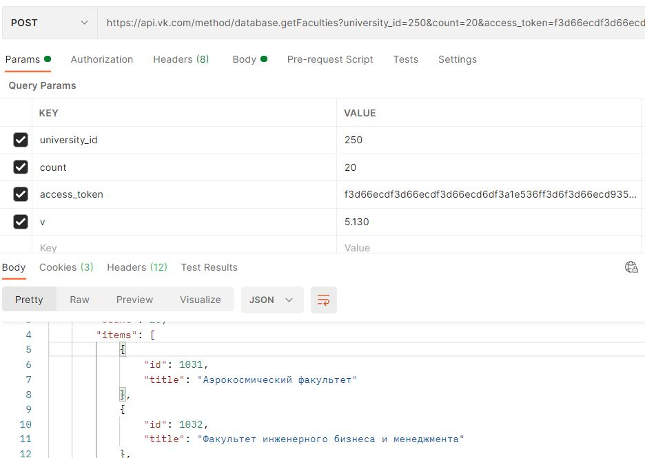
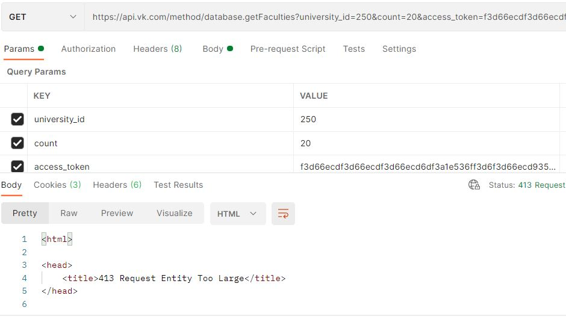
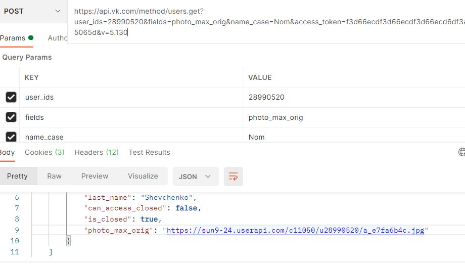
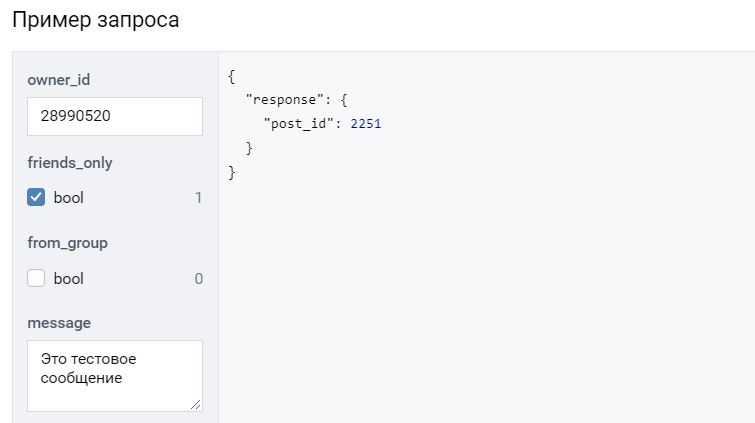

# Отчет по лабораторной работе № 1
  
## 1. HTTP-запросы

### **1.1. Запрос OPTIONS**

Запрос OPTIONS используется для получения информации о методах HTTP-запросов, которые реализует ресурс или сервер. При запросе OPTIONS ресурсу [следует][1] возвращать поля заголовка (header fields), в которых будут перечислены реализуемые методы (например, поле "Allow").  
  
В рамках лабораторной работы с помощью сервиса ***Postman*** запрос OPTIONS был отправлен на следующие URL-адреса:
|Ресурс|Код|Комментарий|
|-|-|-|
|https://kad.arbitr.ru/|200|OK - запрос был выполнен успешно|
|https://github.com/|404|Not Found - сервер не смог найти указанный ресурс. При этом поля зголовка ответа были присланы|
|https://www.google.ru/|405|Method Not Allowed - метод отключен и не может быть использован|
|https://www.kommersant.ru/|200|OK - запрос был выполнен успешно|
|http://mail.ru/|-|-|
|https://www.rambler.ru/|403|Forbidden - сервер понял запрос, но отказывается его авторизовать|
|https://www.youtube.com/|405|Method Not Allowed - метод отключен и не может быть использован|
|http://ya.ru/|403|Forbidden - сервер понял запрос, но отказывается его авторизовать|

При этом ответ согласно спецификации (содеражщий реализуемые методы, перечисленные в поле "Allow") был получен только с ресурсов:

 - https://www.google.ru/
 - https://www.kommersant.ru/

Ошибку выдал ресурс http://mail.ru/ с сообщением `"Invalid character in header content ["pm-o0"]"`

Прочие ресурсы в теле ответа не содержали перечисления реализуемых методов. Ресурс https://www.rambler.ru/ после получения запроса OPTIONS был переадресован на одноименный ресурс с методом запроса GET

### **1.2. Запрос HEAD**

Запрос HEAD используется для тестирования ссылок на валидность, доступность и факт недавних изменений. В ответ на запрос HEAD ресурс [не должен][2] посылать тело ответа, однако ресурсу следует вернуть те же поля заголовка, что и при запросе GET.

В рамках лабораторной работы с помощью сервиса ***Postman*** запрос HEAD был отправлен на следующие URL-адреса:
|Ресурс|Код|Комментарий|
|-|-|-|
|http://www.apple.com/|-|-|
|https://kad.arbitr.ru/|-|-|
|http://www.msn.com/|-|-|
|https://www.kommersant.ru/|-|-|
|http://vk.com/|418|I'm a teapot - [результат первоапрельской шутки][5]|
|https://yandex.ru/|||

При этом ответ согласно спецификации (без тела сообщения) был получен с ресурсов http://vk.com/ и https://yandex.ru/

При запросе на остальные ресурсы в ***Postman*** возникла ошибка `"Error: Cloud agent is unreachable"`

### 1.3. **Запрос GET**

Запрос GET используется для получения конкретного [представления][3] выбранного ресурса

В рамках лабораторной работы с помощью сервиса ***Postman*** запрос GET был отправлен на следующие URL-адреса:
|Ресурс|Код|Комментарий|
|-|-|-|
|http://www.apple.com/|200|OK - запрос был выполнен успешно|
|https://kad.arbitr.ru/|200|OK - запрос был выполнен успешно|
|http://www.google.com/|200|OK - запрос был выполнен успешно|
|https://yandex.ru/|200|OK - запрос был выполнен успешно|

В ответ на указанные запросы ресурсы предоставили в теле сообщения html-документ.

### **1.4. Запрос POST**

Запрос POST используется для передачи данных на [обработку][4] запрашиваемому ресурсу.

В рамках лабораторной работы с помощью сервиса ***Postman*** запрос POST был отправлен на следующие URL-адреса со следующими результатами:
|Ресурс|Код ответа|Комментарий|
|-|-|-|
|http://www.apple.com/|301|Moved Permanently - ресурс был перемещен в URL, указанный поле заголовка. При направлении метод запроса был изменен на GET и перенаправлен на одноименную страницу|
|https://kad.arbitr.ru/|200|OK - запрос был выполнен успешно|
|http://www.google.com/|405|Method Not Allowed - метод отключен и не может быть использован|
|https://yandex.ru/|403|Forbidden - сервер понял запрос, но отказывается его авторизовать|

## 2. Работа с API сайта

### **2.1. Получить список всех факультетов МГТУ им. Баумана, использую API vk.com**

Результат с запросом POST:  

В ответ на запрос возвращается строка в формате JSON, содердащая перечень факультетов  

При этом при запросе GET ресурс в ответ направлял код ошибки 413 - Request Entity Too Large:  

Список факультетов был получен через API-метод [database.getFaculties][6].

>Формулировка запроса:
>>https://api.vk.com/method/database.getFaculties?university_id=250&count=20&access_token=f3d66ecdf3d66ecdf3d66ecd6df3a1e536ff3d6f3d66ecd93545af5d383e5c13345065d&v=5.130

### **2.2. Получить свою аватарку с сайта vk.com**

Результат с запросом POST:

В ответ на запрос возвращается строка в формате JSON, в которой содержится ссылка для скачивания фотографии. JSON-строка с адресом файла была поучена через API-метод [users.get][7].

>Формулировка запроса:
>>https://api.vk.com/method/users.get?user_ids=28990520&fields=photo_max_orig&name_case=Nom&access_token=f3d66ecdf3d66ecdf3d66ecd6df3a1e536ff3d6f3d66ecd93545af5d383e5c13345065d&v=5.130

### **2.3. POST-запрос: отправить сообщение на стену пользователя**

Для отправки сообщения воспользуемся формой из документации API vk.com:

Запрос направляется с использованием API-метода [wall.post][8]

### **2.4. Ответы на вопросы (п. 1.3.2.3 и 1.3.3.2 задания)**

Получение списка факультетов и аватарки:
 - Код ответа от API: 200;
 - Содержание тела ответа: строка в формате JSON;
 - Формат и кодировка ответа: (поле Content-Type) application/json, charset=utf-8;
 - Веб-сервер ответа: kittenx;
 - Версия http: 1.1
Отправка сообщения на стену:
 - в POST-запросах данные передаются от пользователя к серверу не в виде переменных и аргументов URL-адреса, а в теле запроса (request body)

---

*[`cheat-sheet for markdown syntax`](https://www.markdownguide.org/cheat-sheet/)*  

[1]: https://tools.ietf.org/html/rfc7231#section-4.3.7
[2]: https://tools.ietf.org/html/rfc7231#section-4.3.2
[3]: https://tools.ietf.org/html/rfc7231#section-4.3.1
[4]: https://tools.ietf.org/html/rfc7231#section-4.3.3
[5]: https://developer.mozilla.org/ru/docs/Web/HTTP/Status/418
[6]: https://vk.com/dev/database.getFaculties
[7]: https://vk.com/dev/users.get
[8]: https://vk.com/dev/wall.post