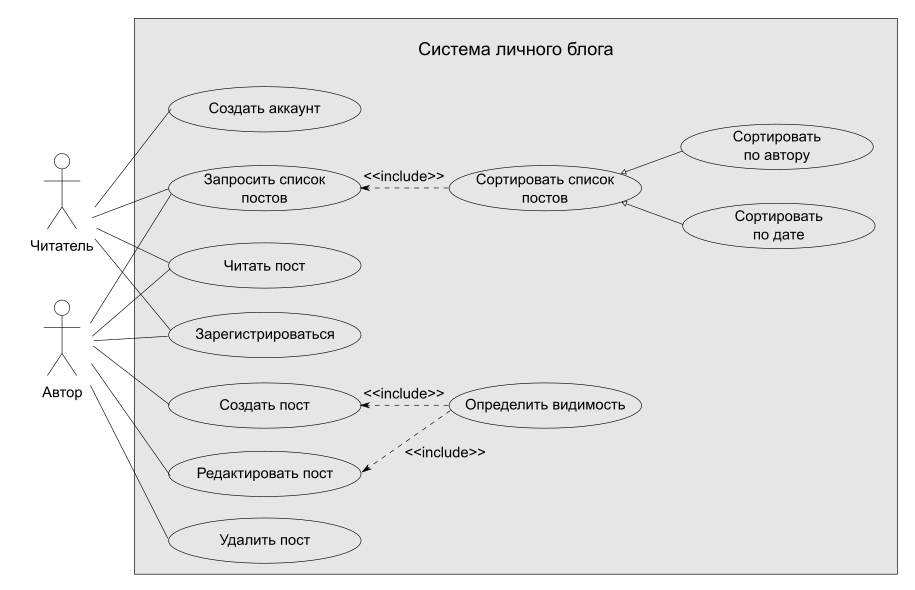
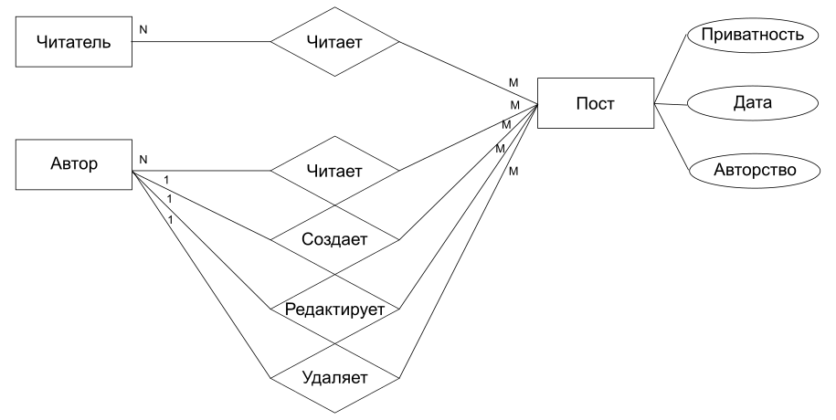
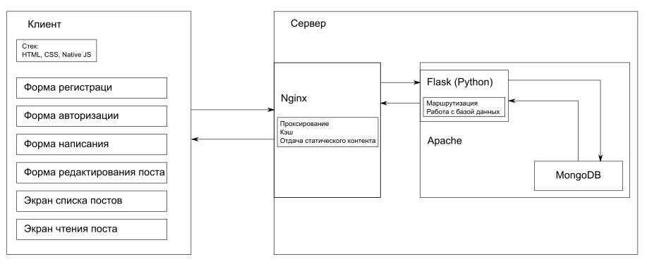

# Отчет по лабораторной работе № 3
# Разработка архитектуры web приложения и прототипирование

## *1. Название проекта*
### **`Твой персональный блог`**

## *2. Краткое описание проблемной области и актуальности*
На настоящий момент существует множетсво широкоизвестных Интернет-сервисов, позволяющих размещать пользовательский контент. Однако подавляющая часть из них имеет либо избыточный функционал с комплексными настройками приватности (например, социальные сети), либо ограничвают размер и вид контента (например, Twitter).
Предлагается разработать простой личный блог для публикации текствого контента без ограничения объема любым зарегистрированным пользователем. Предлагается предусмотреть возможность простой настройки приватности постов, разделив их видимость на три уровня - доступно всем, доступно только зарегистрированным пользователям, доступно только автору.

## *3. Описание ролей пользователя*
### 3.1. Диаграмма UseCase

### 3.2. Роли пользователей
В проекте предполагается наличие двух ролей пользователя:
- Читатель: посетитель ресурса, которому доступны возможности просмотра списка постов и конкретных постов с соответствующим уровнем приватности, сортировка списка постов, а также возможность зарегистрироваться в качестве автора
- Автор: зарегистрированный посетитель ресурса, который помимо возможности просмотра списка постов и отдельных постов может создавать, редактировать и удалять собственные посты
## *4. Сущности предметной области (ER-диаграмма)*

## *5. Прототип интерфейса (со всеми страницами)*
- Moodboard смотри [здесь][1]  
- Прототип на Figma находится [здесь][2]  
## *6. Архитектура приложения*
В качестве архитектуры приложения выбрана модель MPA. Backend и Frontend взаимодействуют по пртоколу HTTP, сервер на Backend'е отдает клиенту по запросу как динамически изменяемую информацию, так и статическую часть страниц сайта приложения.
### Диаграмма взаимодействия Backend-Frontend

### Структура модулей для Backend и Frontend
> - Backend:  
>   - serverconfig (настройки веб-сервера):  
>       - Apache: httpd.conf, myapp.conf
>       - Nginx: nginx.conf
>   - SimpleServer:
>       - \_\_init\_\_.py
>       - app.py
>       - logger.py
>       - logs:
>           - logs.log
>       - MongoDB:...

> - Frontend:
>   - SimpleServer:
>       - html:
>           - index.html
>           - logform.html
>           - postlist.html
>           - postcreate.html
>        - static:
>           - css:
>               - style.css
>           - img:
>               - logo3.png
>           - js:
>               - vanilla.js
## *7. Технические детали реализации*
### 7.1. Backend и Frontend стеки
- в качестве Backend'а используется стек:
    - Nginx+Apach - веб-серверы с проскированием, кэшированием и отдачей статического контента
    - Flask(Python)+MongoDB - сервер приложения для аршрутизации и работы с СУБД, а также база данных для хранения пользовательского контента
- в качестве Frontend'а используется стек:
    - HTML+CSS+NativeJS
### 7.2. Команда разработчиков по ролям:
- разработка сервера приложения: Шевченко И.С.
- конфигурация БД и настройка взаимодействия БД с сервером приложения: Шевченко И.С.
- конфигурация веб-сервера, проксирование, кэширование, отдача статики: Шевченко И.С.
- Верстка: Шевченко И.С.
- UX / Разработка UI: Шевченко И.С.
- Доработка интерактивного функцонала клиента (NativeJS): Шевченко И.С.
---
# *Список Gitlab issues:*
> - 1. Личный блог / Разработка проекта приложения / концепт
>>Сделать: краткое описание и обоснование проекта

> - 2. Личный блог / Разработка проекта приложения / архитектура
>> Сделать: диаграммы взаимодействия, пользовательских ролей, сущностей, структуры модулей

> - 3. Личный блог / Разработка проекта приложения / прототип
>> Сделать (figma): прототип интерфейса со всеми страницами

> - 4. Личный блог / Разработка приложения / backend- сервер приложения
>> Сделать: настроить управление данными и маршрутизацию на сервере приложения (стек - Flask(Python)+MongoDB)

> - 5. Личный блог / Разработка приложения / backend- - веб-сервер
>> Сделать: сконфигурировать развертывание и маршрутизацию/балансировку на веб-серверах (стек - Apache+Nginx)

> - 6. Личный блог / Разработка приложения / frontend - верстка
>> Сделать: шаблоны страниц (стек - HTML+CSS)

> - 7. Личный блог / Разработка приложения / frontend - интерактивность
>> Сделать: интерактивное взаимодействие со страницей на стороне клиента (стек - JS)
---

*[`cheat-sheet for markdown syntax`](https://www.markdownguide.org/cheat-sheet/)*  

[1]: https://www.pinterest.ru/igorshvch/moodboard-for-edu-project-personal-blog/
[2]: www.google.com